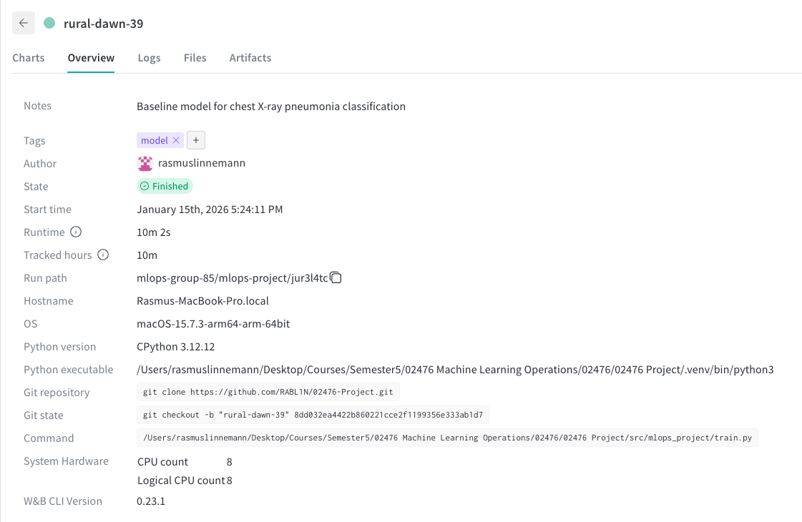
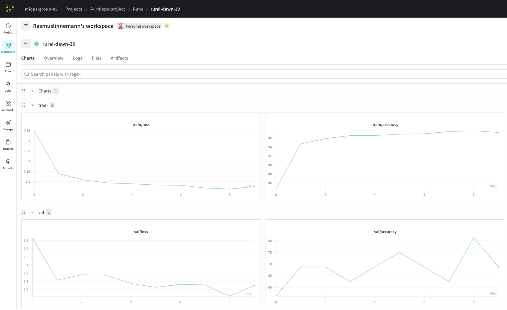
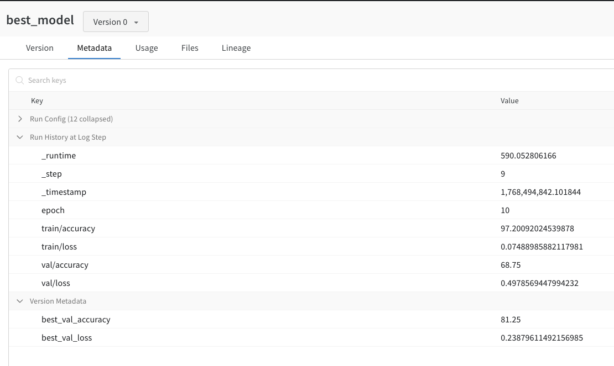
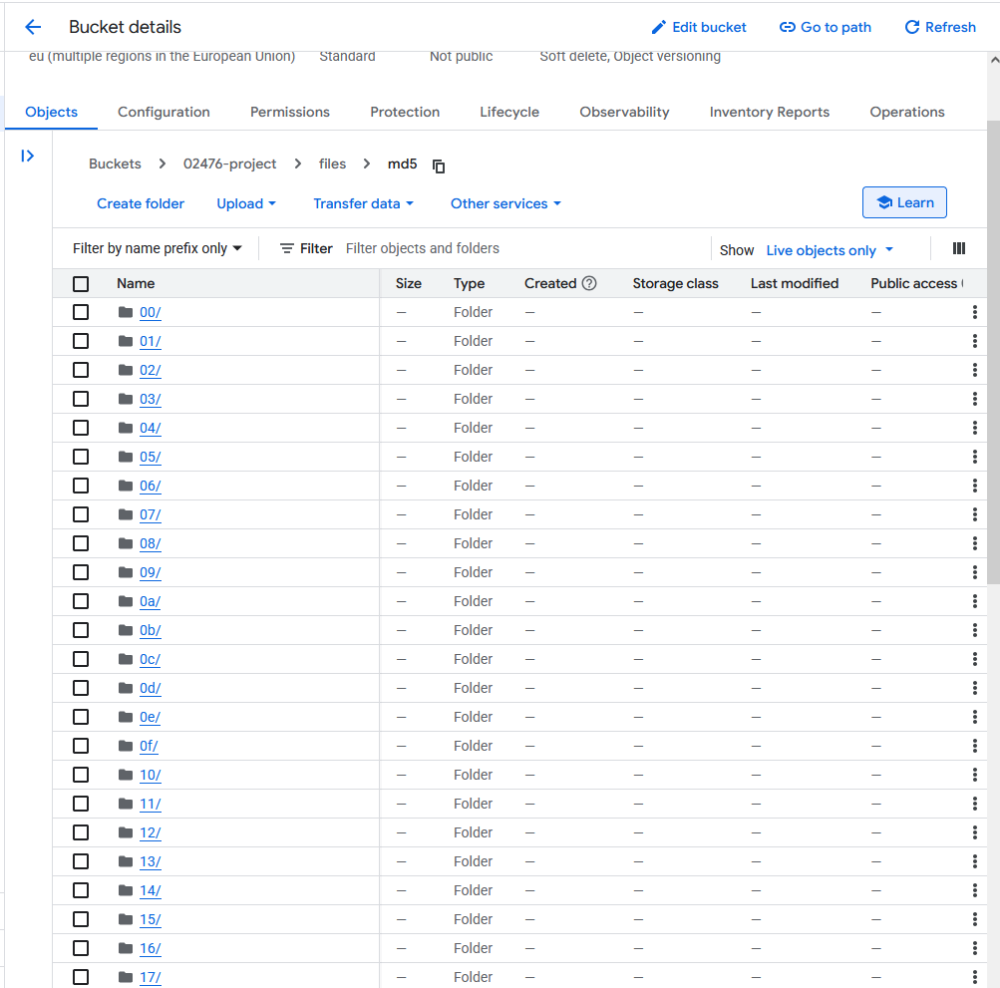
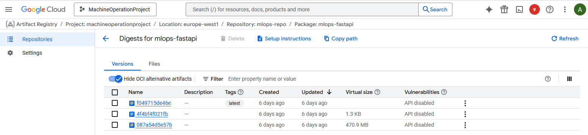
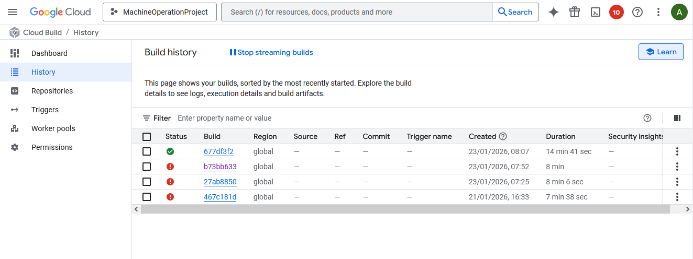

# Exam template for 02476 Machine Learning Operations

This is the report template for the exam. Please only remove the text formatted as with three dashes in front and behind
like:

``--- question 1 fill here ---``

Where you instead should add your answers. Any other changes may have unwanted consequences when your report is
auto-generated at the end of the course. For questions where you are asked to include images, start by adding the image
to the `figures` subfolder (please only use `.png`, `.jpg` or `.jpeg`) and then add the following code in your answer:

``

In addition to this markdown file, we also provide the `report.py` script that provides two utility functions:

Running:

```bash
python report.py html
```

Will generate a `.html` page of your report. After the deadline for answering this template, we will auto-scrape
everything in this `reports` folder and then use this utility to generate a `.html` page that will be your serve
as your final hand-in.

Running

```bash
python report.py check
```

Will check your answers in this template against the constraints listed for each question e.g. is your answer too
short, too long, or have you included an image when asked. For both functions to work you mustn't rename anything.
The script has two dependencies that can be installed with

```bash
pip install typer markdown
```

or

```bash
uv add typer markdown
```

## Overall project checklist

The checklist is *exhaustive* which means that it includes everything that you could do on the project included in the
curriculum in this course. Therefore, we do not expect at all that you have checked all boxes at the end of the project.
The parenthesis at the end indicates what module the bullet point is related to. Please be honest in your answers, we
will check the repositories and the code to verify your answers.

### Week 1

* [X] Create a git repository (M5)
* [X] Make sure that all team members have write access to the GitHub repository (M5)
* [X] Create a dedicated environment for you project to keep track of your packages (M2)
* [X] Create the initial file structure using cookiecutter with an appropriate template (M6)
* [X] Fill out the `data.py` file such that it downloads whatever data you need and preprocesses it (if necessary) (M6)
* [X] Add a model to `model.py` and a training procedure to `train.py` and get that running (M6)
* [X] Remember to either fill out the `requirements.txt`/`requirements_dev.txt` files or keeping your
  `pyproject.toml`/`uv.lock` up-to-date with whatever dependencies that you are using (M2+M6)
* [X] Remember to comply with good coding practices (`pep8`) while doing the project (M7)
* [X] Do a bit of code typing and remember to document essential parts of your code (M7)
* [X] Setup version control for your data or part of your data (M8)
* [X] Add command line interfaces and project commands to your code where it makes sense (M9)
* [X] Construct one or multiple docker files for your code (M10)
* [X] Build the docker files locally and make sure they work as intended (M10)
* [X] Write one or multiple configurations files for your experiments (M11)
* [X] Used Hydra to load the configurations and manage your hyperparameters (M11)
* [X] Use profiling to optimize your code (M12)
* [X] Use logging to log important events in your code (M14)
* [X] Use Weights & Biases to log training progress and other important metrics/artifacts in your code (M14)
* [ ] Consider running a hyperparameter optimization sweep (M14)
* [X] Use PyTorch-lightning (if applicable) to reduce the amount of boilerplate in your code (M15)

### Week 2

* [X] Write unit tests related to the data part of your code (M16)
* [X] Write unit tests related to model construction and or model training (M16)
* [X] Calculate the code coverage (M16)
* [X] Get some continuous integration running on the GitHub repository (M17)
* [X] Add caching and multi-os/python/pytorch testing to your continuous integration (M17)
* [X] Add a linting step to your continuous integration (M17)
* [X] Add pre-commit hooks to your version control setup (M18)
* [X] Add a continues workflow that triggers when data changes (M19)
* [X] Add a continues workflow that triggers when changes to the model registry is made (M19)
* [X] Create a data storage in GCP Bucket for your data and link this with your data version control setup (M21)
* [ ] Create a trigger workflow for automatically building your docker images (M21)
* [X] Get your model training in GCP using either the Engine or Vertex AI (M21)
* [X] Create a FastAPI application that can do inference using your model (M22)
* [X] Deploy your model in GCP using either Functions or Run as the backend (M23)
* [X] Write API tests for your application and setup continues integration for these (M24)
* [X] Load test your application (M24)
* [ ] Create a more specialized ML-deployment API using either ONNX or BentoML, or both (M25)
* [X] Create a frontend for your API (M26)

### Week 3

* [ ] Check how robust your model is towards data drifting (M27)
* [X] Deploy to the cloud a drift detection API (M27)
* [X] Instrument your API with a couple of system metrics (M28)
* [X] Setup cloud monitoring of your instrumented application (M28)
* [X] Create one or more alert systems in GCP to alert you if your app is not behaving correctly (M28)
* [X] If applicable, optimize the performance of your data loading using distributed data loading (M29)
* [X] If applicable, optimize the performance of your training pipeline by using distributed training (M30)
* [ ] Play around with quantization, compilation and pruning for you trained models to increase inference speed (M31)

### Extra

* [X] Write some documentation for your application (M32)
* [X] Publish the documentation to GitHub Pages (M32)
* [X] Revisit your initial project description. Did the project turn out as you wanted?
* [X] Create an architectural diagram over your MLOps pipeline
* [X] Make sure all group members have an understanding about all parts of the project
* [X] Uploaded all your code to GitHub

## Group information

### Question 1

> **Enter the group number you signed up on <learn.inside.dtu.dk>**
>
> Answer:

85

### Question 2

> **Enter the study number for each member in the group**
>
> Example:
>
> *sXXXXXX, sXXXXXX, sXXXXXX*
>
> Answer:

s234835, s215207, s215115, s257188, s234806

### Question 3

> **Did you end up using any open-source frameworks/packages not covered in the course during your project? If so**
> **which did you use and how did they help you complete the project?**
>
> Recommended answer length: 0-200 words.
>
> Example:
> *We used the third-party framework ... in our project. We used functionality ... and functionality ... from the*
> *package to do ... and ... in our project*.
>
> Answer:

Throughout the project we used a combination of open-source frameworks aligned with the DTU MLOps curriculum and applied them in practice to build a complete workflow. For data versioning, we used DVC together with a Google Cloud Storage remote, enabling reproducible dataset management beyond local files. Weights & Biases (wandb) was used for experiment tracking and model management, including logging metrics and managing model artifacts.

The inference service was implemented using FastAPI, allowing us to expose model prediction endpoints for cloud deployment. To evaluate system performance under load, we used Locust to simulate concurrent users and stress-test the deployed API. Dependency management was handled using uv, which ensured consistent environments across local development, CI pipelines, and cloud machines by locking exact dependency versions. Together, these tools enabled an end-to-end MLOps pipeline covering data versioning, training, CI/CD, and deployment.

## Coding environment

> In the following section we are interested in learning more about you local development environment. This includes
> how you managed dependencies, the structure of your code and how you managed code quality.

### Question 4

> **Explain how you managed dependencies in your project? Explain the process a new team member would have to go**
> **through to get an exact copy of your environment.**
>
> Recommended answer length: 100-200 words
>
> Example:
> *We used ... for managing our dependencies. The list of dependencies was auto-generated using ... . To get a*
> *complete copy of our development environment, one would have to run the following commands*
>
> Answer:

We managed dependencies in this project using the uv package manager. All project dependencies are declared in the pyproject.toml file, which serves as the single source of truth for required packages. Exact, pinned dependency versions are stored in the automatically generated uv.lock file. This ensures that the same dependency versions are installed across different machines, operating systems, and environments.

To obtain an exact copy of the development environment, a new team member would first need to clone the GitHub repository, then install uv and ensure it is available in their system path. From the project root, running uv sync will create a virtual environment and install all dependencies exactly as specified in uv.lock. The same setup is used in continuous integration workflows and cloud training environments, ensuring full reproducibility across local development, CI, and deployment.

### Question 5

> **We expect that you initialized your project using the cookiecutter template. Explain the overall structure of your**
> **code. What did you fill out? Did you deviate from the template in some way?**
>
> Recommended answer length: 100-200 words
>
> Example:
> *From the cookiecutter template we have filled out the ... , ... and ... folder. We have removed the ... folder*
> *because we did not use any ... in our project. We have added an ... folder that contains ... for running our*
> *experiments.*
>
> Answer:

The project was initialized using the provided cookiecutter MLOps template, which we followed closely and filled out the core components required for a complete MLOps workflow. The src/mlops_project directory contains the main application logic, including data handling, model definition, training, evaluation, and the FastAPI inference API. The tests directory was populated with unit tests for data processing, model construction, and training logic, following the structure suggested by the template.

Configuration files were placed in the configs directory and managed using Hydra to support reproducible and configurable training experiments. The data directory was used together with DVC to track and version datasets stored remotely in a Google Cloud Storage bucket. Continuous integration workflows were implemented under .github/workflows, extending the template with additional pipelines for linting, data-change triggers, and staged model testing based on model registry updates.

We deviated slightly from the original template by adding a frontend directory for a Streamlit application, a load_tests directory for Locust-based load testing, and additional Dockerfiles to support both training and deployment.

### Question 6

> **Did you implement any rules for code quality and format? What about typing and documentation? Additionally,**
> **explain with your own words why these concepts matters in larger projects.**
>
> Recommended answer length: 100-200 words.
>
> Example:
> *We used ... for linting and ... for formatting. We also used ... for typing and ... for documentation. These*
> *concepts are important in larger projects because ... . For example, typing ...*
>
> Answer:

We used ruff for linting and ruff for formatting. We did not use typing a lot, but we did use Google-styled doc-strings for documentation, as well as mkdocs in extension to a README file. We implemented our formatting (as well as our tests) using github workflows, such that we automatically test linting when we push to main.
These concepts are important in larger projects because they help prevent superficial mistakes and ensures that new developers can easily read the code which have been written. Typing (which we did not use extensively) can also help in catching early errors, especially in more complicated code with multiple types.

## Version control

> In the following section we are interested in how version control was used in your project during development to
> corporate and increase the quality of your code.

### Question 7

> **How many tests did you implement and what are they testing in your code?**
>
> Recommended answer length: 50-100 words.
>
> Example:
> *In total we have implemented X tests. Primarily we are testing ... and ... as these the most critical parts of our*
> *application but also ... .*
>
> Answer:

We have implemented 77 pytest (uv run pytest --collect-only) style tests. Primarily we are testing our model, our training loop, our API, our dataloader/dataset and our staged models.
We have chosen to test these, as they are some of the most crucial parts of our project. As stated above, we have created a github workflow to automatically run these tests, when we push to main.

### Question 8

> **What is the total code coverage (in percentage) of your code? If your code had a code coverage of 100% (or close**
> **to), would you still trust it to be error free? Explain you reasoning.**
>
> Recommended answer length: 100-200 words.
>
> Example:
> *The total code coverage of code is X%, which includes all our source code. We are far from 100% coverage of our **
> *code and even if we were then...*
>
> Answer:

Our code coverage is 24%. The data, evaluation, api and model scripts are the ones which are covered the best. However, we do not have any tests written for the code that was refactored for lightning, and our training loop is hard to test, as it is very integrated with wandb, and meant to be run with external dependencies, that makes testing harder.
Even if we had 100% tests we would still not trust our code to be error free, as tests can only cover so much. There can always be edge cases that are not covered by the tests, and there can also be logical errors in the code that are not caught by the tests.

### Question 9

> **Did you workflow include using branches and pull requests? If yes, explain how. If not, explain how branches and**
> **pull request can help improve version control.**
>
> Recommended answer length: 100-200 words.
>
> Example:
> *We made use of both branches and PRs in our project. In our group, each member had an branch that they worked on in*
> *addition to the main branch. To merge code we ...*
>
> Answer:

In our project we used branches a lot, but not pull requests, as we were a small group, so we mostly relied on real time communication in cases of code problems. Instead of having a branch for each person directly we mostly created branches for features or fixes that we wanted to implement, and then merged them into main when they were done. This helped us keep the main branch stable, as we could test the feature branches before merging them in. We used both git and github to manage our branches and used both the CLI for git and VSCode's git integration to manage our branches.

### Question 10

> **Did you use DVC for managing data in your project? If yes, then how did it improve your project to have version**
> **control of your data. If no, explain a case where it would be beneficial to have version control of your data.**
>
> Recommended answer length: 100-200 words.
>
> Example:
> *We did make use of DVC in the following way: ... . In the end it helped us in ... for controlling ... part of our*
> *pipeline*
>
> Answer:

We used DVC to have version control on our dataset as well as keep it separate from Git. We were able to track the data directory with 'dvc add ...' and committed the thereby generated '.dvc' files and 'dvc.lock' to the repository. The files held information about the remote repository and what data we were using. The actual data files were stored in a shared Google Drive remote storage. 

This enabled us to be able to all use the same dataset state with 'dvc pull' command. This improved the project by making the data used for training and evaluation the same for all of us. Each Git commit points to an exact data version, so we can rerun experiments and thereby get consistent results. It helped the collaboration and make communication easier this way. 

### Question 11

> **Discuss you continuous integration setup. What kind of continuous integration are you running (unittesting,**
> **linting, etc.)? Do you test multiple operating systems, Python  version etc. Do you make use of caching? Feel free**
> **to insert a link to one of your GitHub actions workflow.**
>
> Recommended answer length: 200-300 words.
>
> Example:
> *We have organized our continuous integration into 3 separate files: one for doing ..., one for running ... testing*
> *and one for running ... . In particular for our ..., we used ... .An example of a triggered workflow can be seen*
> *here: `<weblink>`*
>
> Answer:

For continious integration we have organized our workflows into a 6 separate files in our GitHub Actions setup. The first workflow (tests) is for testing our code, which includes running our unit tests and checking code coverage. This workflow tests multiple operating systems (Ubuntu and MacOS) and Python versions (3.12) to ensure compatibility across different environments. We also make use of caching for uv to speed up dependency installation.
The second workflow (stage_model and test_staged_model) is for testing newly staged models. This workflow is triggered by a repository dispatch event from WandB and tests the staged model using a separate test script. It also uses caching for uv and tests on Ubuntu.
The third (linting) is for checking linting of the code using ruff. This workflow is triggered on pushes and pull requests to the main branch and checks the code for linting errors.
The fourth workflow (docs) is for building and deploying our documentation to GitHub pages. This workflow is triggered on pushes to the main branch and builds the documentation using mkdocs.
The fifth workflow, data_changes is triggered when there are changes to data tracked by DVC. It runs tests to ensure that the code works with the new data.

## Running code and tracking experiments

> In the following section we are interested in learning more about the experimental setup for running your code and
> especially the reproducibility of your experiments.

### Question 12

> **How did you configure experiments? Did you make use of config files? Explain with coding examples of how you would**
> **run a experiment.**
>
> Recommended answer length: 50-100 words.
>
> Example:
> *We used a simple argparser, that worked in the following way: Python  my_script.py --lr 1e-3 --batch_size 25*
>
> Answer:

We configured our experiments using Hydra configuration files. The configuration files are stored in the configs directory to allow for easy management of different experiment settings. This way, we could run experiments with different configurations without changing the code itself. To run an experiment, we would simply change the config file and run the training script using uv.
```bash
uv run invoke train
```


### Question 13

> **Reproducibility of experiments are important. Related to the last question, how did you secure that no information**
> **is lost when running experiments and that your experiments are reproducible?**
>
> Recommended answer length: 100-200 words.
>
> Example:
> *We made use of config files. Whenever an experiment is run the following happens: ... . To reproduce an experiment*
> *one would have to do ...*
>
> Answer:

To be able to reproduce our experiments, we have set up 2 safeguards, WandB and hydra. WandB saves every experiment that we run, including the config files, the metrics and the model artifacts. This way we can always go back and see what settings we used for a particular experiment, and we can also download the model artifacts to use them later. Hydra allows us to manage our configuration files in a structured way, so we can easily change settings and run experiments with different configurations. When we have completed a run, hydra also saves the configuration used for that experiments in the outputs directory, so we can always go back and see what settings we used for a particular experiment. To reproduce an experiment, one would have to go to WandB, find the experiment and download the config file and the model artifacts. Then one would have to set up the environment using uv and run the training script with the downloaded config file.

### Question 14

> **Upload 1 to 3 screenshots that show the experiments that you have done in W&B (or another experiment tracking**
> **service of your choice). This may include loss graphs, logged images, hyperparameter sweeps etc. You can take**
> **inspiration from [this figure](figures/wandb.png). Explain what metrics you are tracking and why they are**
> **important.**
>
> Recommended answer length: 200-300 words + 1 to 3 screenshots.
>
> Example:
> *As seen in the first image when have tracked ... and ... which both inform us about ... in our experiments.*
> *As seen in the second image we are also tracking ... and ...*
>
> Answer:

We used Weights & Biases (W&B) to track all our training experiments for the chest X-ray pneumonia classification model. As seen in the first image (best_model_overview_v0.png), W&B automatically tracks system information including hardware specifications, Python version, operating system, and runtime environment. This information is crucial for reproducibility, as it ensures we can recreate the exact conditions under which our model was trained.



As seen in the second image (best_model_charts_v0.png), we tracked and visualized key training and validation metrics including loss and accuracy for both training and validation sets. These metrics are logged at each epoch, allowing us to monitor the model's learning progress. The training loss and accuracy inform us about how well the model is learning from the training data, while validation metrics are crucial for assessing generalization performance. By comparing these curves, we can identify when the model starts overfitting (validation metrics plateau or worsen while training metrics continue improving) and implement early stopping accordingly.



The third image (best_model_v0.png) shows the model artifact stored in W&B, which includes metadata such as the best validation accuracy (81.25%) and best validation loss. We also logged hyperparameters including learning rate, batch size, number of epochs, and model architecture parameters. These metrics are important because they enable us to compare different experimental runs, reproduce successful configurations, and select the best-performing model for deployment. The validation accuracy is particularly critical as it directly measures how well our model will perform on unseen data, which is the ultimate goal for a medical diagnosis application.



### Question 15

> **Docker is an important tool for creating containerized applications. Explain how you used docker in your**
> **experiments/project? Include how you would run your docker images and include a link to one of your docker files.**
>
> Recommended answer length: 100-200 words.
>
> Example:
> *For our project we developed several images: one for training, inference and deployment. For example to run the*
> *training docker image: `docker run trainer:latest lr=1e-3 batch_size=64`. Link to docker file: `<weblink>`*
>
> Answer:

For our project we developed several Docker images: one for training and two for API inference (one for local development and one for cloud deployment).

The training Docker image (`dockerfiles/train.dockerfile`) uses the uv package manager and can be run with `docker run train:latest` followed by Hydra configuration arguments like `learning_rate=0.001 batch_size=64`. This ensures reproducible training environments across different machines.

For API inference, we have two Docker images. The local API image (`dockerfiles/api.dockerfile`) can be built with `docker build -t api:latest -f dockerfiles/api.dockerfile .` and run with `docker run -p 8000:8000 api:latest` for local testing. The cloud API Docker image (`backend/Dockerfile`) is used for cloud deployment and automatically downloads the best model from WandB during the build process. To build it, we use `docker build -t mlops-fastapi:latest --build-arg WANDB_API_KEY=your_key -f backend/Dockerfile .` and then run it with `docker run -p 8080:8080 -e PORT=8080 mlops-fastapi:latest`. This image is deployed to Google Cloud Run for production inference and provides multiple endpoints including `/predict` for model predictions and `/drift/features` for data drift detection. 

### Question 16

> **When running into bugs while trying to run your experiments, how did you perform debugging? Additionally, did you**
> **try to profile your code or do you think it is already perfect?**
>
> Recommended answer length: 100-200 words.
>
> Example:
> *Debugging method was dependent on group member. Some just used ... and others used ... . We did a single profiling*
> *run of our main code at some point that showed ...*
>
> Answer:

For debugging we mostly used logging and the VSCode built in python debugger. Logging allowed us to see what was happening in the code without having to stop the execution, and the VSCode debugger allowed us to step through the code and see what was happening at each step. 
For bugs in the infrastructure (CI/CD, DVC, GCP etc.) we mostly relied on the error messages provided by the services, as they were usually quite descriptive and pointed us in the right direction. On top of this we used the documentation of the services to understand what was going wrong.
We did not do any profiling of our code, as we did not have any major performance issues. However, we did try to write efficient code from the start, as we knew that we would be running our code quite some times during development and testing.
We could have used profiling to identify bottlenecks in our code, especially as we were running on a limited budget for GCP, but we found other tasks more interesting.

## Working in the cloud

> In the following section we would like to know more about your experience when developing in the cloud.

### Question 17

> **List all the GCP services that you made use of in your project and shortly explain what each service does?**
>
> Recommended answer length: 50-200 words.
>
> Example:
> *We used the following two services: Engine and Bucket. Engine is used for... and Bucket is used for...*
>
> Answer:

We used the following 5 services: Cloud Run, VM Manager, Networking, Cloud Storage and Compute Engine:
Cloud run is used for deploying our containerized FastAPI backend as well as frontend.
VM Manager is used for monitoring Compute Engine VMs.
Networking is used to monitor resources and traffic used by the project through other services.
Cloud Storage is used for storing large files such as datasets and artifacts.
Compute Engine is virtual machines used for running training jobs or experiments.

### Question 18

> **The backbone of GCP is the Compute engine. Explained how you made use of this service and what type of VMs**
> **you used?**
>
> Recommended answer length: 100-200 words.
>
> Example:
> *We used the compute engine to run our ... . We used instances with the following hardware: ... and we started the*
> *using a custom container: ...*
>
> Answer:

The GCP Engine was used as the primary infrastructure for model training in this project. We created a dedicated virtual machine (VM) to run training workloads that were computationally heavier than what was practical to run locally. The VM acted as a reproducible training environment that could be synced with the GitHub repository and the DVC-managed dataset stored in a Google Cloud Storage bucket.

The VM was configured with a standard Linux-based image and sufficient CPU and memory resources to support training a convolutional neural network on image data. GPU acceleration was not strictly required for this project, so we relied on CPU-based instances. Dependencies were installed using the same uv-based setup as in local development to ensure environment consistency.

Training was triggered manually after syncing the repository and data to the VM using provided setup and sync scripts. Experiment metrics and trained models were logged to Weights & Biases, allowing us to monitor training remotely without direct interaction with the VM. This setup ensured reproducibility, scalability, and separation between development and training environments.

### Question 19

> **Insert 1-2 images of your GCP bucket, such that we can see what data you have stored in it.**
> **You can take inspiration from [this figure](figures/bucket.png).**
>
> Answer:



### Question 20

> **Upload 1-2 images of your GCP artifact registry, such that we can see the different docker images that you have**
> **stored. You can take inspiration from [this figure](figures/registry.png).**
>
> Answer:



### Question 21

> **Upload 1-2 images of your GCP cloud build history, so we can see the history of the images that have been build in**
> **your project. You can take inspiration from [this figure](figures/build.png).**
>
> Answer:



### Question 22

> **Did you manage to train your model in the cloud using either the Engine or Vertex AI? If yes, explain how you did**
> **it. If not, describe why.**
>
> Recommended answer length: 100-200 words.
>
> Example:
> *We managed to train our model in the cloud using the Engine. We did this by ... . The reason we choose the Engine*
> *was because ...*
>
> Answer:

We managed to train our model in the cloud using the Engine (Google Cloud Compute Engine). We did this by creating a dedicated virtual machine instance in the europe-west1-d zone, which provided a reproducible training environment separate from our local development setup. The VM was configured with sufficient CPU and memory resources to handle training a convolutional neural network on chest X-ray images.

To set up the training environment, we used setup scripts that cloned our GitHub repository to the VM and installed dependencies using the same uv-based package management system used locally, ensuring environment consistency. The training data was accessed from a Google Cloud Storage bucket managed through DVC, allowing the VM to pull the required datasets without storing them locally.

Training was executed manually by SSH-ing into the VM and running the training script, which used PyTorch Lightning and logged all metrics and model artifacts to Weights & Biases. We chose the Engine over Vertex AI because it provided more direct control over the training environment, was simpler to set up for our needs, and offered a cost-effective solution for CPU-based training without requiring the additional abstraction layer that Vertex AI provides.

## Deployment

### Question 23

> **Did you manage to write an API for your model? If yes, explain how you did it and if you did anything special. If**
> **not, explain how you would do it.**
>
> Recommended answer length: 100-200 words.
>
> Example:
> *We did manage to write an API for our model. We used FastAPI to do this. We did this by ... . We also added ...*
> *to the API to make it more ...*
>
> Answer:

We implemented a FastAPI backend that loads the best trained model from WandB and exposes HTTP endpoints a user can interact with. The main endpoint to do so is '/predict', where you can upload an image file, apply the same preprocessing as during training, and then run the model to return the predicted class, if it is NORMAL (0) or PNEUMONIA (1). We also added a '/health' endpoint to see if the side is up and running (mostly used for testing), and an endpoint for checking data drifting. We kept it very basic with only the neceszary endpoints to have a working environment. 

### Question 24

> **Did you manage to deploy your API, either in locally or cloud? If not, describe why. If yes, describe how and**
> **preferably how you invoke your deployed service?**
>
> Recommended answer length: 100-200 words.
>
> Example:
> *For deployment we wrapped our model into application using ... . We first tried locally serving the model, which*
> *worked. Afterwards we deployed it in the cloud, using ... . To invoke the service an user would call*
> *`curl -X POST -F "file=@file.json"<weburl>`*
>
> Answer:

We managed to deploy our API both locally and in the cloud. Locally we run the FastAPI application with Uvicorn and can access the endpoints on 'http://127.0.0.1:8000/. This service can use '/health' for availability check and '/predict' for evaluating an image. For the cloud deployment, we containerized the frontend and beckend sperately with Docker and deployed each container to Google Cloud Run, which gives us a public HTTPS URL we can use to access the endpoints. To invoke the service an user would use the following command:
curl -X POST https://https://mlops-fastapi-304008424690.europe-west1.run.app/predict -F "file=@path/to/xray.png"

or uses the frontend at:
https://mlops-frontend-304008424690.europe-west1.run.app

We also added an endpoint for checking data drifting which was also deployed as an API with the rest of the service. The data drifting can be checked with the following command:
curl -X POST https://YOUR_CLOUD_RUN_URL/drift/features -H "Content-Type: application/json" --data-binary "@drift_payload.json"


### Question 25

> **Did you perform any unit testing and load testing of your API? If yes, explain how you did it and what results for**
> **the load testing did you get. If not, explain how you would do it.**
>
> Recommended answer length: 100-200 words.
>
> Example:
> *For unit testing we used ... and for load testing we used ... . The results of the load testing showed that ...*
> *before the service crashed.*
>
> Answer:

We did both unit testing and load testing of our API. For unit testing we used pytest and FastAPI's TestClient to test that the main endpoints responded as expected. We included tests for '/health' to ensure that the service returns code 200. We also implemented tests for '/predict' where we uploaded a small example image (taken randomly from the dataset) and verified that the response contained the expected fields. For load testing we used Locust to generate specific loads of traffic against the deployed Cloud Run URL. We defined a locust instance with 20 concurrent users that would send requests once per 2 seconds and has no performance issues what so ever. Only the '/predict' endpoint was load tested. 

### Question 26

> **Did you manage to implement monitoring of your deployed model? If yes, explain how it works. If not, explain how**
> **monitoring would help the longevity of your application.**
>
> Recommended answer length: 100-200 words.
>
> Example:
> *We did not manage to implement monitoring. We would like to have monitoring implemented such that over time we could*
> *measure ... and ... that would inform us about this ... behaviour of our application.*
>
> Answer:

We did implement monitoring of our deployed model. Since the API s deployed on Goggle Cloud Run, we used Cloud Runs' built-in metrics to track things like request count, request latence ect. We also created two SLO's for availability and latency to define expeced service behavier over time. On top of this, we created alerting policies in Cloud Monitoring so we would get notifications if the service didn't live up a specific threshold for latency or if the service starts returning server errors, indicating that it isn't working. For monitoring the model itself, we added the drift endpoint '/drift/features' we can use to compare incoming feature batches against a stored reference.This can help discover drifting early as we can follow how data might change over time. This monitoring can help the longevity of the application because it can makes problems visible before they appear to the users. So it is all about discovering issues before they become overwhelming. 

## Overall discussion of project

> In the following section we would like you to think about the general structure of your project.

### Question 27

> **How many credits did you end up using during the project and what service was most expensive? In general what do**
> **you think about working in the cloud?**
>
> Recommended answer length: 100-200 words.
>
> Example:
> *Group member 1 used ..., Group member 2 used ..., in total ... credits was spend during development. The service*
> *costing the most was ... due to ... . Working in the cloud was ...*
>
> Answer:

In total we ended up using 228.37 danish crowns (DKK). The largest factor came from Compute Engine with 223.27 DKK, followed by other services with small contributions: Cloud Run 0.33 DKK, Cloud Storage 0.76 DKK, networking 2.34 DKK and VM Manager 2.34 DKK. There are multiple reasons why Compute Engine is so large compared to the others. The first thing is that we chose a VM with high RAM and many vCPUs available to speed up the training as much as possible. It was decided that since the training was done in a short time, the specific VM choice would not matter much. However, it was not taken into account that the person responsible for stopping the instance would forget to do so. It was fun to work in the cloud during this project, as it made many things possible that would otherwise not have been. The scaling and power of the cloud makes it an effective tool, but also a complex one. We faced some struggles when setting things up, especially with permissions, where people sometimes lacked access to perform assigned tasks. By being persistent, we managed to get most things working and see the results of our work.

### Question 28

> **Did you implement anything extra in your project that is not covered by other questions? Maybe you implemented**
> **a frontend for your API, use extra version control features, a drift detection service, a kubernetes cluster etc.**
> **If yes, explain what you did and why.**
>
> Recommended answer length: 0-200 words.
>
> Example:
> *We implemented a frontend for our API. We did this because we wanted to show the user ... . The frontend was*
> *implemented using ...*
>
> Answer:

We implemented a small frontend for our FastAPI backend. The frontend was used to make the model easier to test and demonstrate. It provides a simple interface where a user can upload a chest X-ray image and get back the predicted class (NORMAL vs PNEUMONIA). This also helped us verify the full flow end-to-end: request handling, preprocessing, model inference, and response formatting. The frontend was deployed in the same way as the backend (containerized and run through Cloud Run) so it matched the rest of our deployment setup.


### Question 29

> **Include a figure that describes the overall architecture of your system and what services that you make use of.**
> **You can take inspiration from [this figure](figures/overview.png). Additionally, in your own words, explain the**
> **overall steps in figure.**
>
> Recommended answer length: 200-400 words
>
> Example:
>
> *The starting point of the diagram is our local setup, where we integrated ... and ... and ... into our code.*
> *Whenever we commit code and push to GitHub, it auto triggers ... and ... . From there the diagram shows ...*
>
> Answer:


The figure illustrates the overall architecture of our machine learning system and the services used throughout the MLOps lifecycle. The starting point of the diagram is the local development setup, where we develop the code and configurations for data processing, model training, and deployment. Dependency management is handled consistently across environments to ensure reproducibility. When changes are committed and pushed to the GitHub repository, this automatically triggers continuous integration workflows using GitHub Actions.

GitHub Actions is responsible for running unit tests, linting, and validation steps to ensure code quality. In parallel, data is versioned using DVC, with datasets stored remotely in a Google Cloud Storage (GCS) bucket. This allows the exact dataset versions used for training to be reproduced across different machines and environments.

For training, the versioned data is pulled from GCS to a Google Cloud Compute Engine virtual machine, where the model is trained. During training, metrics, logs, and artifacts are tracked using Weights & Biases (W&B). Trained models are stored in the W&B model registry, providing traceability and versioning of model artifacts. Changes to the model registry can trigger additional validation steps, such as staged model tests, to ensure model quality before deployment.

Once a model has passed validation, it is packaged into a Docker image together with a FastAPI-based inference service. This container is deployed to Google Cloud, where it runs as a scalable backend service. End users interact with the deployed system by sending HTTP requests to the FastAPI endpoint to obtain predictions. Overall, the architecture integrates data versioning, continuous integration, cloud-based training, model management, containerization, and deployment into a single coherent and reproducible MLOps pipeline.

### Question 30

> **Discuss the overall struggles of the project. Where did you spend most time and what did you do to overcome these**
> **challenges?**
>
> Recommended answer length: 200-400 words.
>
> Example:
> *The biggest challenges in the project was using ... tool to do ... . The reason for this was ...*
>
> Answer:

For the unit testing and github workflows one of the biggest struggles was in getting the webhook to work between WandB and GitHub. This was a matter of setting up proper API keys and sharing permissions between the two services. This was especially cumbersome, as it would only be tested on new models being staged, meaning that we had to train a new model for each test of the webhook, and since our webhook was sent to GitHub, we could not (easily) test it locally using act.

Another struggle we faced a lot was cloud permissions and IAM. Many of the failures we met throughout the project when working with Cloud Console were not code issues but instead during to lack of permissions for group members to fulfil different tasks. It was sometimes also not very clear by the error messages if the problem at hand was happening due to a lacking role of a functionality issue so each time it happened, a debugging process would start but likely end up with a new role for that user. Because of this, it was also difficult to provide minimal roles to group members as the priority to get things working often weighted more than giving the exact and minimal permission to perform a task. We image this would look different in an actual project setup.

Setting up monitoring through Cloud Console was also difficult because, not because the actual setup was difficult, but because it was difficult to find an intuition about where the different thresholds should be placed to create meaningful errors that wasn't just spam. As this was a section in the learning material, to not overly warn people by alerts and only provide meaningful ones, it was investigated further, but to actually learn this, we would need more experience within the field. 


### Question 31

> **State the individual contributions of each team member. This is required information from DTU, because we need to**
> **make sure all members contributed actively to the project. Additionally, state if/how you have used generative AI**
> **tools in your project.**
>
> Recommended answer length: 50-300 words.
>
> Example:
> *Student sXXXXXX was in charge of developing of setting up the initial cookie cutter project and developing of the*
> *docker containers for training our applications.*
> *Student sXXXXXX was in charge of training our models in the cloud and deploying them afterwards.*
> *All members contributed to code by...*
> *We have used ChatGPT to help debug our code. Additionally, we used GitHub Copilot to help write some of our code.*
> Answer:

The-Laug (s215115) - Focused on core code development, refactoring, and training improvements. Their commits include adding PyTorch Lightning support and distributed data loading, work on staged model tests and CI integration, initial setup of model and training code, and other backend structural changes. This includes maintaining the model training logic and test setups that underpin correct automated workflows.

AFugl (s215207) - Focused on API functionality, DevOps, and CI/CD infrastructure. Their commits include backend Docker work, adding and fixing API endpoints, load testing configuration, merging branches related to fastapi inference, updating checklist statuses, and tests to make api.py and CI tests work correctly. They also worked on GCP VM sync scripts and data versioning with DVC and GCS.

MariusNiss (s234835) - Contributed to project integration, usability, and system-level design. They implemented and refined a command-line interface for core workflows such as data downloading, training, and testing, ensuring consistent usage across local, CI, and cloud environments. They configured and debugged pre-commit hooks and GitHub Actions workflows, including linting, data-change triggers, and staged model validation. They also assisted with cloud deployment, designed and documented the overall MLOps architecture diagram, and contributed to the README and overall project documentation.

RABL1N (s234806) - Contributed across multiple areas including foundational setup, initial model commits, training logic additions, DVC and GCS integration, WandB logging and model registry integration, and broader cloud deployment documentation. They also updated tests and fixed various configuration and GitHub Pages documentation issues.

k-rst-n (s257188) - Chose the subject matter consistent with PhD topic. They helped plan tests and test workflows and CI/CD. Their commits contain housekeeping via ruff and documentation as well as profiling of the models. Due to their limited prior experience, they leared a lot from the high level of expertise in the group.

All members actively participated in code reviews, task coordination, debugging, and development decisions throughout the project. Generative AI tools such as ChatGPT were used to clarify concepts, write and debug code, and help generate documentation text, and GitHub Copilot was used to assist with writing and completing code segments.
